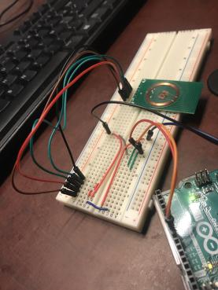
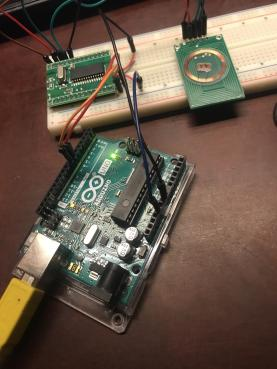
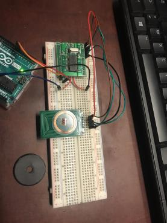
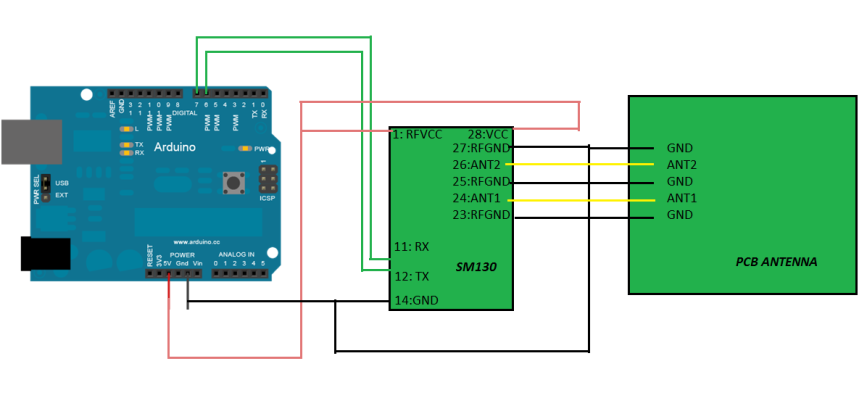

# Matériels 
Pour effectuer le montage correspondant au projet, on utilisera:
    • Arduino UNO: sera programmé pour analyser et produire les signaux
        électriques souhaités pour le bon fonctionnement du circuit.
    • Platine d’expérimentation: pour réaliser le prototype du circuit
        électronique et pour le tester.
    • Lecteur RFID(SM130, PCB ANTENNA): pour coordonner la communication RFID et la lecture des
        étiquettes radiofréquence.
    • Puce RFID: contenant un identifiant et éventuellement des données
        complémentaires.
    • Fils de raccordement: pour la liaison entre les composants, et la
        transmission de l’énergie et de l’information.
    • Actionneur: aura un comportement lié à l’état du système, selon la
        réponse du serveur (ouvert ou fermé).
    • Diodes Électroluminescentes: pour visualiser l’état du système, selon
        la réponse du serveur.

# Images
## Circuits

